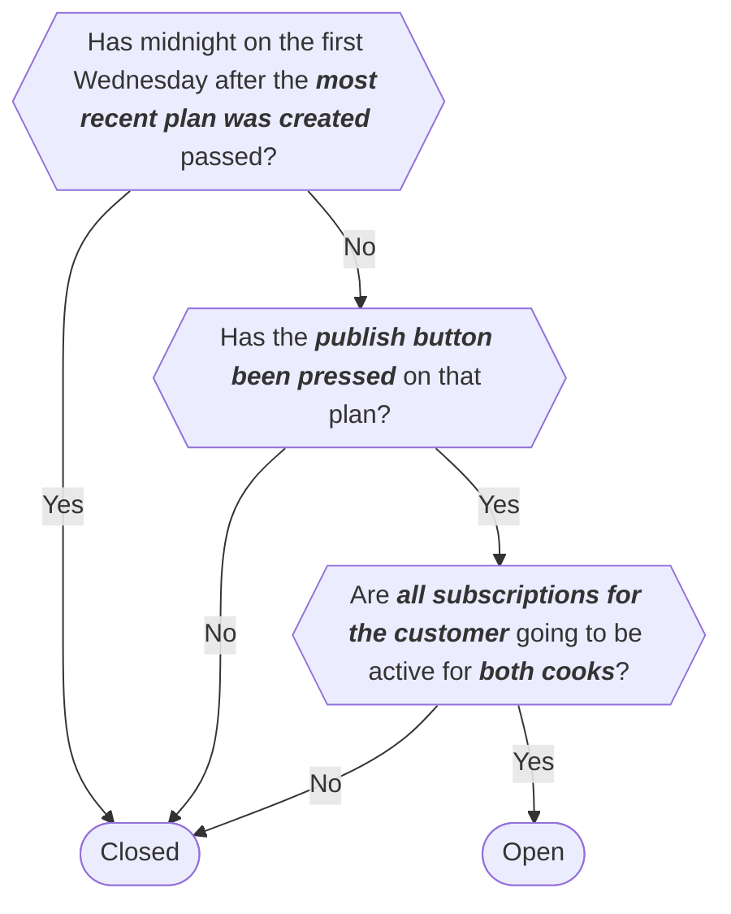

# Is the plan open or closed?

The logic that governs whether a plan is open or closed is governed using the following flow

this will impact the following parts of the application

- Whether the [make choices button](../Pages/account.md#choose-meals-button) is enabled or disabled on the account page
- Whether the [choose meals page](../Pages/choose-meals.md) is accessible
