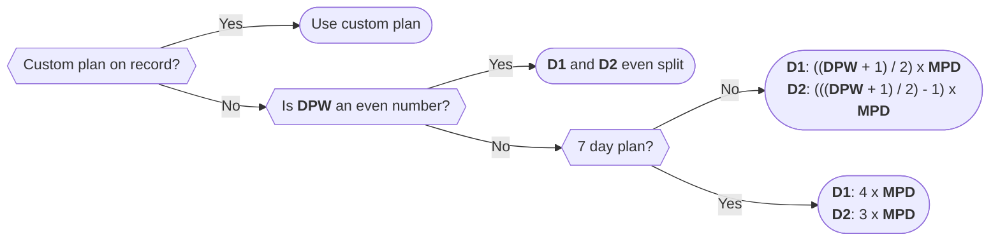

# Meal Plan Generation

Once a selection of recipes has been picked using [planning mode](../Pages/recipes.md#planning-mode) on the recipes page, the system will automatically generate a plan containing details of exactly what meals should be cooked for each customer. It does so using the following set of rules

## Subscription status

Meals are only added to the plan for a given customer of the customer's chargebee status is expected to be `active` on the _date entered in the planning mode dialog box for a given cook_. This means if a customer is expected to be _paused_ on that date, they will get 0 meals

## Number of meals per delivery

To calculate how many meals should be allocated for a given plan on each delivery, the following algorithm is used. Note the following abbreviations

- **MPD** - Meals per day
- **DPW** - Days per week
- **D1** - Delivery 1
- **D2** - Delivery 2

## Allocating meals per plan

Given this number and a set of meals that the business has selected will be cooked, meals are then allocated on a rotating basis starting with the first recipe. So given the set of recipes A, B, C, D and E, if a customer has two plans, one Micro (with 6 meals in this delivery) and one Mass (with 3 meals in this delivery), they will be allocated in the following way

| Plan  |     |     |     |     |     |     |
| ----- | --- | --- | --- | --- | --- | --- |
| Micro | A   | B   | C   | D   | E   | A   |
| Mass  | A   | B   | C   |     |     |     |

### Exclusions

Given the same set of recipes, if recipe `B` is tagged with `no pork` as an `exclusion`, and a customer is tagged with `no pork`, the planning algorithm will simply skip recipe `B` when allocating. So you'll get a distribution that looks like this

| Plan  |     |     |     |     |     |     |
| ----- | --- | --- | --- | --- | --- | --- |
| Micro | A   | C   | D   | E   | A   | C   |
| Mass  | A   | C   | A   |     |     |     |

:::warning
At the time of writing, meal `B` will still be visible to the customer on the [choose meals](../Pages/choose-meals.md) page - with a quantity set to zero.
:::

### Alternates

It is possible to tag recipes as 'alternate' recipes. This means mark a recipe so that

- Given recipe D
- If the customer is tagged with `x`
- Supply recipe F instead

:::info
This behaviour is recursive - if `F` were found to have an `F->G` alternate tag that also matches the tags attached to the customer, recipe `G` will be supplied instead
:::

So given the same set of recipes, but assuming that the `D->F` alternate tag is applied and the customer has a matching tag, the distribution for that customer will now look like this

| Plan  |     |     |     |       |     |     |
| ----- | --- | --- | --- | ----- | --- | --- |
| Micro | A   | B   | C   | **F** | E   | A   |
| Mass  | A   | B   | C   |       |     |     |

### Extras

Some plans are identified by the application as 'extras' (this is derived from [a custom field](../Technical%20Documentation/integration-with-chargebee.md#data-model) in places but is also hardcoded in a few places, so you might want to ask **Ben** if you have to touch this!). In the case of an extra, the [number of meals per delivery](#number-of-meals-per-delivery) logic is still used, but we are not drawing from the selected recipes any more. So given the above set of meals and a customer who had 6 Micro meals and 3 Breakfasts, you'd get something like this.

| Plan      |     |     |     |     |     |     |
| --------- | --- | --- | --- | --- | --- | --- |
| Micro     | A   | B   | C   | D   | E   | A   |
| Breakfast | Ex  | Ex  | Ex  |     |     |     |

Indicating that we would cook

- **A** x 2
- **B, C, D, E** x 1
- **Breakfast** x 3

### Customisations

:::warning
Customisations are not _technically_ related to the planning algorithm, because they don't change what meal gets picked for a customer. However, I'm including this here for the sake of completeness
:::

When a meal is tagged with an available customisation that means 'when a customer also has this customisation tag, the kitchen needs to make an alteration'. In this case, given meal `A` with tag `x` when a customer also has tag `X`, the following will happen

- The alteration will be highlighted on the cook plan
- The alteration will be highlighted on the pack plan
- The alteration will be visible on the meal label