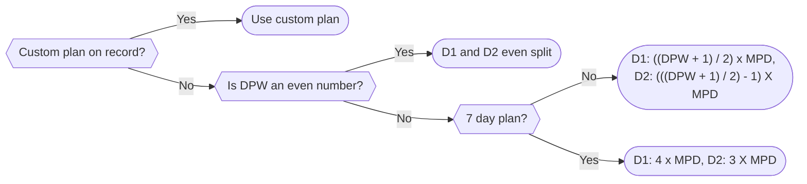

# Plan

## Generating a Plan

The recipes page provides a 'planning mode' the purpose of which is to allow the business to select which meals are going to be cooked over a given two week period. To use it:

- Click `Planning Mode`
- On the right hand side click `Pick Meals` under `Cook 1`
- Tick a checkbox next to all the meals that are to be included in the first cook of the week
- Input the date of the cook in the input box

:::warning
This date should be the date that the meals are actually _cooked_ on. When generating a meal plan, the application will compare this date with records of subscription pauses per customer in order to decide if they should receive meals or not
:::

- Click `Pick Meals` under `Cook 2`
- Tick a checkbox next to all the meals that are to be included in the first cook of the week
- Input the date of the cook in the input box
- Click `Send to Planner`

## The Planning Algorithm

At this point, you can click through to the [planner](../Pages/planner.md) page to see a visual representation of each customer and what meals they are going to recieve each week, which can be edited on that page and then downloaded as a PDF. In order to actually _pick_ the meals available for each customer, the following algorithms are used:

### Number of meals per delivery

To calculate how many meals should be allocated for a given plan on each delivery, the following algorithm is used. Note the following abbreviations

- MPD: Meals per day
- DPW: Days per week
- D1/D2: Delivery 1/Delivery 2

### Allocating meals per plan

Given this number and a set of meals that the business has selected will be cooked, meals are then allocated on a rotating basis starting with the first recipe. So given the set of recipes A, B, C, D and E, if a customer has two plans, one Micro (with 6 meals in this delivery) and one Mass (with 3 meals in this delivery), they will be allocated in the following way

| Plan  |     |     |     |     |     |     |
| ----- | --- | --- | --- | --- | --- | --- |
| Micro | A   | B   | C   | D   | E   | A   |
| Mass  | A   | B   | C   |     |     |     |
