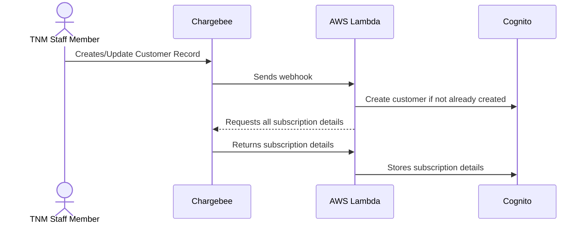

## Webhook Interactions

The application is configured to respond to webhooks sent from the Chargebee API when certain events take place.

### Customer Created or Updated

The following sequence takes place on either create or update customer

### Data Model

In order to map the Chargebee data model to one that makes sense to us, we apply the following constraints

- Every Chargebee [plan](https://apidocs.chargebee.com/docs/api/v1/plans) represents a specific meal type/days of week/meals per day combination
- We use [custom fields](https://www.chargebee.com/docs/2.0/custom_fields.html) on the plan in order to identify how many **meals per day** and how many **days per week** that plan applies to. This MUST be filled in for the plan to be valid
- Each plan in Chargebee has to be attached to an [item family](https://apidocs.chargebee.com/docs/api/item_families?lang=curl) we've added an 'is extra' custom field which [helps us decided if the plan is a recipe or not](../Features/meal-plan-generation.md#extras)
- Customer records have a few [custom fields](https://www.chargebee.com/docs/2.0/custom_fields.html) attached, currently the ones we use are [delivery days](../Pages/choose-meals.md#delivery-day) and number of bags
