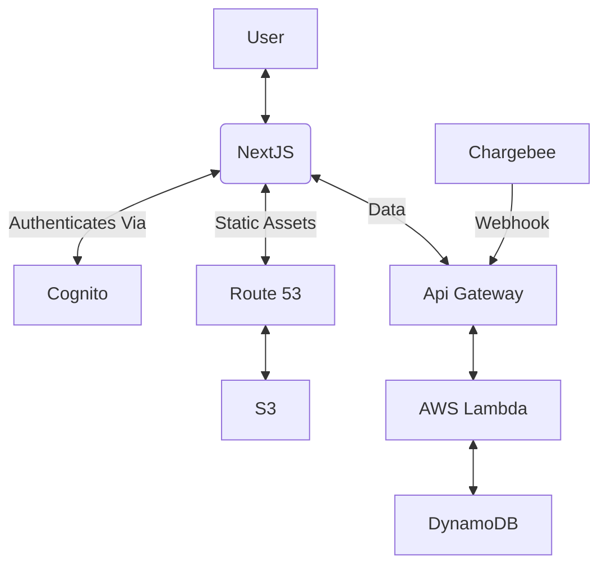

# Cloud Architecture

The application is hosted on AWS. It is a statically rendered NextJS application backed by an API built on API Gateway, AWS Lambda and AWS Dynamodb. See [AWS Resources](./aws-resources.md) for more details.

