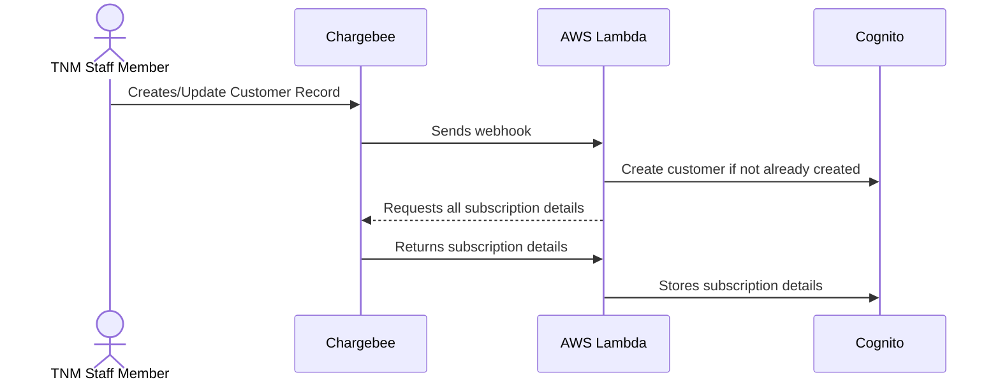

# ChargeBee Integration

## Webhook Interactions

The application is configured to respond to webhooks sent from the Chargebee API when certain events take place.

### Customer Created or Updated

The following sequence takes place on either create or update customer

